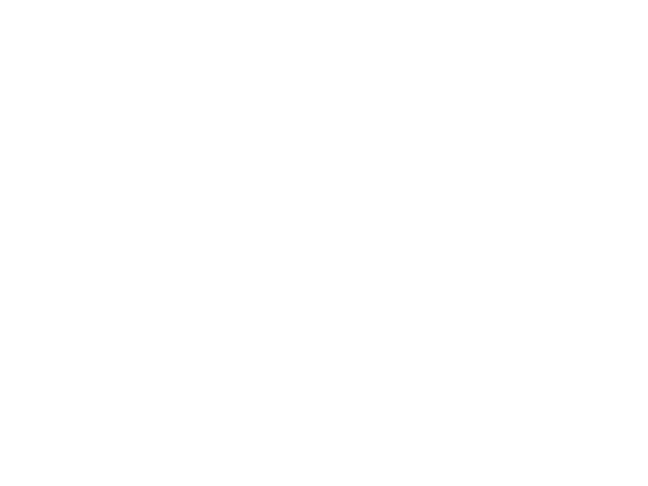

# Voz Animal

Recreation of the Santuário Voz Animal website in Angular 13 + Wordpress REST API

## About the project
Santuário Voz Animal is an animal protection institution in Rio Grande do Sul state, Brazil, that shelters rescued or abandoned animals and only exists because of the work of dozens of volunteers and financial aid from donators.
There are over 300 animals: cats, dogs, horses, cows, pigs, poultry and one sheep, Dolly.

Live site: [https://www.santuariovozanimal.com.br](https://www.santuariovozanimal.com.br)

## Contributing

If you want to help with this project in any way, reach me out at `otaviopetry@gmail.com` or catch me live at [https://www.twitch.tv/otavio_things](https://www.twitch.tv/otavio_things)

## Pre-requisites

- Node version 12.20.x/14.15.x/16.10

## Installing

- Clone this project, navigate to its directory and run `npm install`

## Development server

Run `ng serve` for a dev server. Navigate to `http://localhost:4200/`. The application will automatically reload if you change any of the source files.

